# ⚡ Automation & AI Integration Portfolio

¡Hola! 👋 Soy **Leonardo Murano**, estudiante de Programación e **Instructor de Automatización con n8n**.

Este repositorio centraliza mis proyectos más recientes enfocados en la optimización de procesos de negocio, integraciones de APIs y desarrollo de soluciones con Inteligencia Artificial.

🔗 **LinkedIn:** [Leonardo Murano](https://www.linkedin.com/in/leonardo-murano/)  
📧 **Contacto:** leomellimurano@gmail.com

---

## 🛠 Tech Stack
* **Core:** n8n (Workflow Automation), HTML, JavaScript, SQL.
* **AI & Data:** Groq API, Cohere API, Google Gemini API, Supabase (Vector DB), RAG implementation.
* **Integrations:** Google Workspace APIs, Telegram API, AFIP SDK, Webhooks, Model Context Protocol (MCP).
* **Tools:** Git, Postman, SQL.

---

## 📂 Proyectos Destacados

### 1. 🧠 Sistema RAG (Retrieval-Augmented Generation) con IA
**Objetivo:** Mantener actualizado el contexto de un asistente de IA en tiempo real y disponibilizarlo vía chat.
* **Tecnologías:** n8n, Supabase (pgvector), JavaScript.
* **Flujos:**
    * **Flujo 1 - Sistema RAG (Backend):**
        * Monitoreo automático de archivos cada 5 minutos.
        * Lógica condicional para detectar: *Creación, Modificación o Eliminación*.
        * Actualización automática de **Embeddings** en la base de datos vectorial.
    * **Flujo 2 - Chatbot de Telegram (Frontend):**
        * Interfaz de chat donde el usuario interactúa con el Sistema RAG.
        * Integración de Tool de Supabase Vector Store para recuperación de documentos (Retrieval) para el Agente de IA.
* 📂 *[Ver flujos en carpeta /01-RAG-Supabase]*

#### Capturas del Flujo de carga de documentos RAG (Backend)

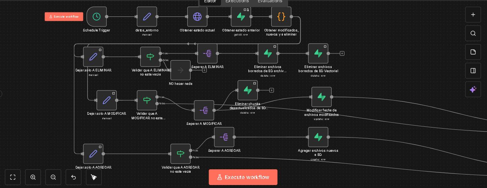
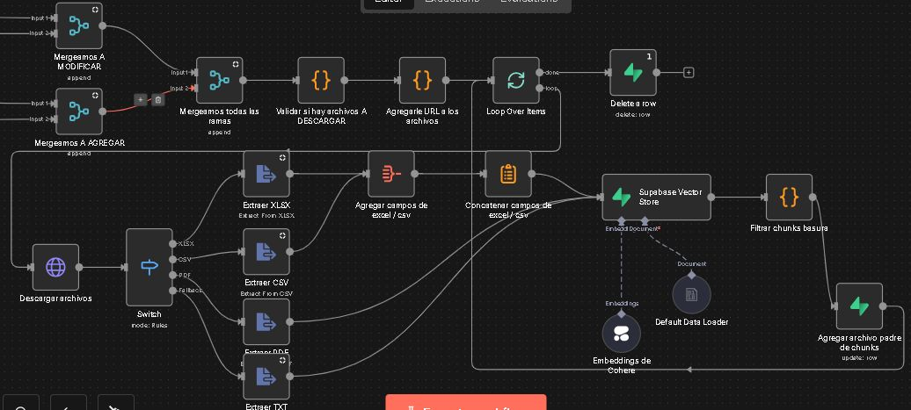

#### Captura del Flujo del chatbot RAG (Frontend)

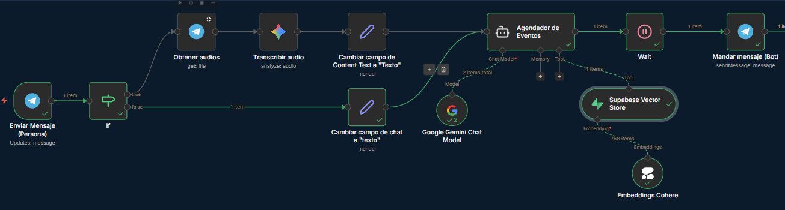

#### Captura del chatbot de telegram
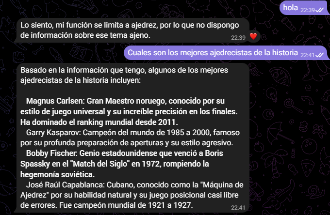

### 2. 🧾 Automatización de Facturación (AFIP)
**Objetivo:** Eliminar la carga manual de facturación y envío de comprobantes fiscales.
* **Tecnologías:** n8n, AFIP SDK, JavaScript, HTML (para template).
* **Flujo:**
    * Conexión con el Web Service de AFIP para autorización de comprobantes (CAE).
    * Generación dinámica de código QR y renderizado del PDF de la factura.
    * Envío automático por correo electrónico al cliente final.
* 📂 *[Ver flujo en carpeta /02-Facturacion-AFIP]*

#### Captura del Flujo de AFIP SDK

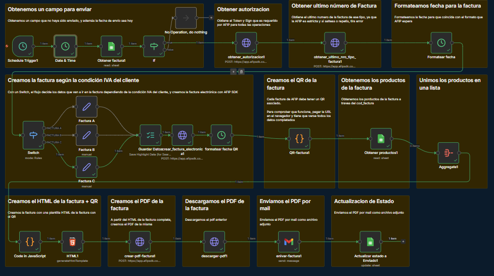

#### Factura generada a partir del HTML con QR

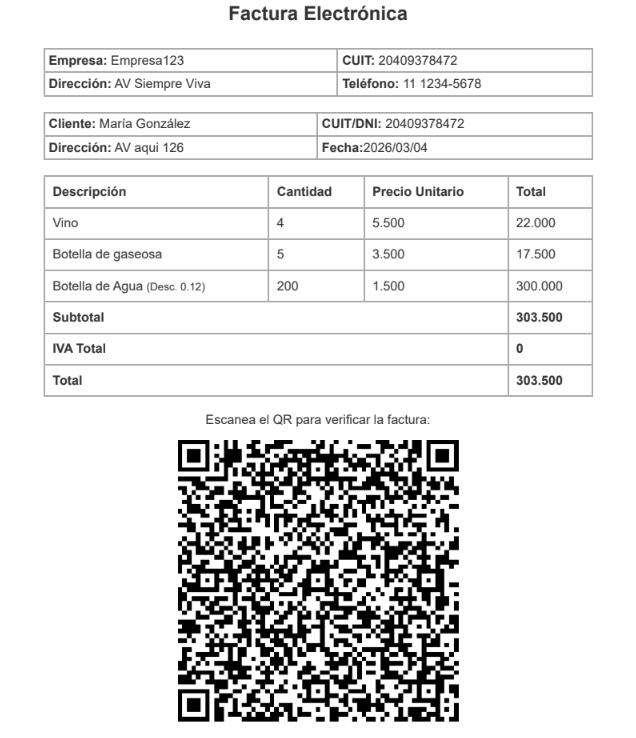

### 3. 📅 Bot de Gestión de Eventos con Telegram + MCP
**Objetivo:** Gestión avanzada de Google Calendar mediante IA multimodal.
* **Tecnologías:** n8n, Telegram Bot API, Google Calendar, MCP (Model Context Protocol).
* **Flujos:**
    * **Flujo 1 - Bot de Telegram (AI Agent):**
        * Permite crear, leer y eliminar eventos del calendario mediante lenguaje natural.
        * **Multimodal:** El agente entiende tanto mensajes de texto como notas de audio (Whisper/Speech-to-Text).
    * **Flujo 2 - Servidor MCP:**
        * Implementación de servidor MCP para proveer contexto dinámico y herramientas de Google Calendar al agente de IA de manera estandarizada.
* 📂 *[Ver flujos en carpeta /03-a-Telegram-AIBot]*

#### Captura del chatbot de telegram (Client MCP)
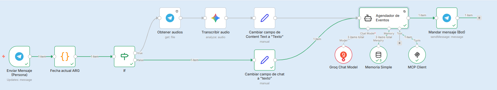

#### Captura del chatbot de telegram (MCP Server)
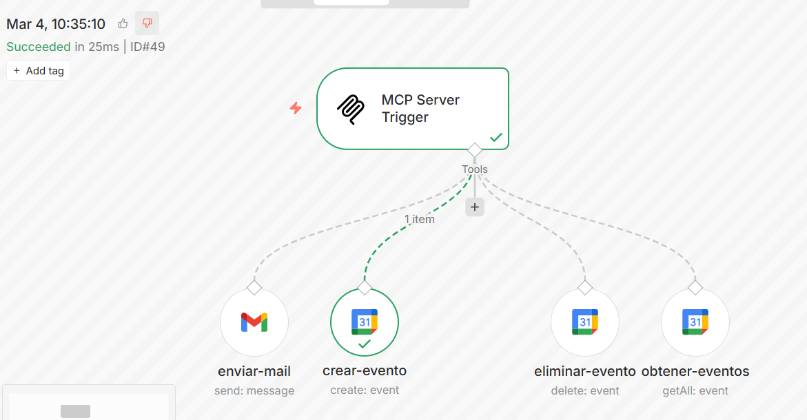

#### Captura de la respuesta del chatbot en Telegram
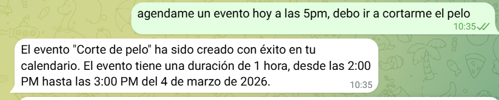

#### Captura del evento en Calendar
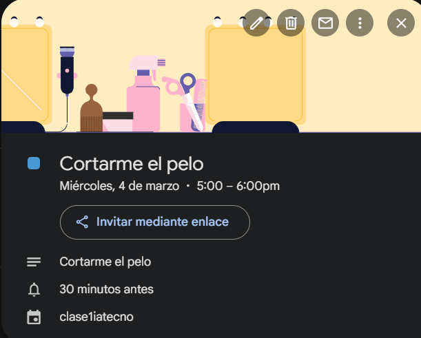

### 4. 📅 Gestión de Citas (Cal.com + Google Workspace)
**Objetivo:** Sincronización automática de agenda y CRM básico.
* **Tecnologías:** n8n, Cal.com Webhooks, Google Sheets, Gmail.
* **Flujo:**
    * Captura de Webhooks de Cal.com ante nuevas reservas.
    * Registro de la información del cliente en Google Sheets (Base de datos).
    * Disparo automático de correos de confirmación personalizados.
* 📂 *[Ver flujo en carpeta /04-Citas-gestion]*

#### Captura del flujo de gestion de citas con cal

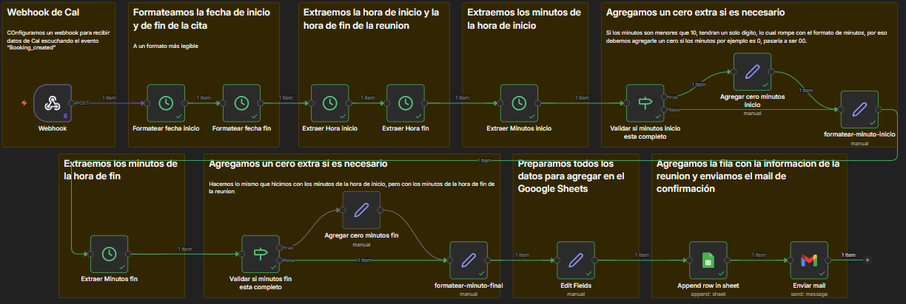

#### Captura del mail eenviado cuando el usuario registra una cita

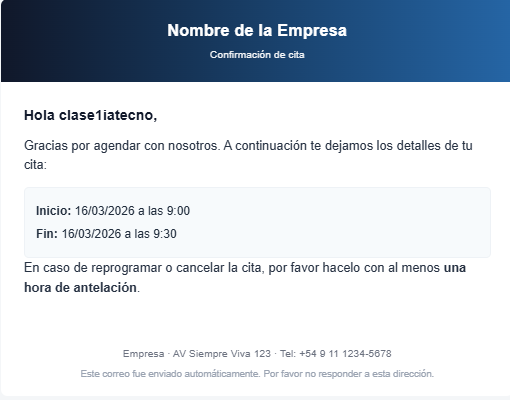

### 5. 📩 Clasificador de emails (AI + Google Workspace)
**Objetivo:** Clasificar los emails entrantes con etiquetas.
* **Tecnologías:** n8n, Gmail Trigger, AI (api de Grog), Google Sheets.
* **Flujo:**
    * Llega un mail mediante el Gmail Trigger.
    * El agente de IA asigna una etiqueta.
    * Lo registramos en un google sheets y lo marcamos como leido.
* 📂 *[Ver flujo en carpeta /05-emails-classifier]*

### 6. 📩 Gestionador de emails (AI + Google Workspace)
**Objetivo:** Gestionarr los emails entrantes dependiendo del tipo que sean.
* **Tecnologías:** n8n, Gmail Trigger, AI (api de Grog), Google Sheets, Slack.
* **Flujo:**
    * LLega un mail mediante el Gmail Trigger.
    * El agente de IA asigna una etiqueta.
    * Si es SPAM lo elimina
    * Si es soporte, envia un mensaje a un canal de Stack
    * Si es facturacion (archivo binario) lo guarda en un servidor
    * Todos los mails se registran en un google sheets y los marcamos como leido.
* **Calculo de ROI:** Este flujo integra el nuevo nodo de métricas de n8n para cuantificar el impacto de la automatización, lo cual hace que el tiempo ahorrado del flujo varie dependiendo de la rama que se ejecute, lo que da como resultado un calculo de ROI más acertado
* 📂 *[Ver flujo en carpeta /06-emails-manager]*

---

## 🚀 Cómo usar estos flujos
Los archivos `.json` incluidos en este repositorio son exportaciones directas de n8n.
1.  Descarga el archivo JSON del proyecto que te interese.
2.  En tu instancia de n8n, ve a **Workflow** > **Import from File**.
3.  Configura tus propias credenciales (las claves han sido removidas por seguridad).

---
*Repositorio creado para demostración técnica - 2025*
